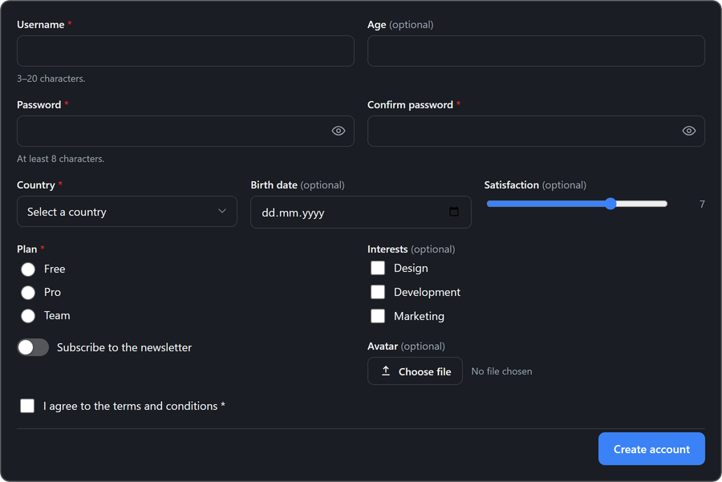

<p align="center">
  
</p>

<h1 align="center">Neiki's Forms</h1>

<p align="center">
  
  
  
  
  <br>
  
  
</p>

<p align="center">
  <b>Lightweight, CDN-ready Forms Web Component</b><br>
  <i>Zero dependencies, framework-independent, drop into any page.</i>
</p>

<p align="center">
  
  
  
  
</p>

---

<p align="center">
  
</p>

---

**Live version:** [https://neikiri.dev/forms](https://neikiri.dev/forms)

---

## Overview

Neiki's Forms is a Web Component written in plain JavaScript with **zero dependencies**. Drop a single `<neiki-forms>` tag onto a page, feed it a schema, and get a beautifully styled, responsive, accessible form — with built-in field types, validation, multi-step (wizard) mode, theming and i18n — with no framework, bundler, or build step required.

```html
<script src="https://cdn.neikiri.dev/neiki-forms/neiki-forms.min.js"></script>

<neiki-forms id="fm"></neiki-forms>
<script>
  document.getElementById('fm').setSchema({
    fields: [
      { type: 'text', name: 'name', label: 'Full name', required: true, width: 'half' },
      { type: 'email', name: 'email', label: 'Email', required: true, width: 'half' },
      { type: 'textarea', name: 'message', label: 'Message', rows: 4 }
    ],
    submitLabel: 'Send message'
  });
</script>
```

That snippet is a complete, working, validated contact form. From there you can add more field types, split it into steps, theme it, translate it, and wire up your own submit handler through a small set of cancelable events.

---

## Why Neiki's Forms?

- **One script, no dependencies.** The component ships as a single custom element. No React, Vue, Svelte, or Angular required — it works in plain HTML just as well as inside any framework.
- **CDN-ready.** Load it from jsDelivr or unpkg and start using `<neiki-forms>` immediately.
- **Schema-driven.** Describe your form as a plain JavaScript (or JSON) object — fields, labels, validation rules and layout — and the component renders it. No hand-written markup per field.
- **Backend-agnostic by design.** Submitting a form first dispatches a cancelable `submit` event with both structured `values` and a ready-to-use `FormData`; call `preventDefault()` to talk to your own API, or set the `action` attribute and let the component `fetch()` it for you.
- **18 built-in field types.** Text, email, password (with show/hide toggle), number, tel, url, search, date/time variants, color, textarea, select (single & multiple), checkbox, checkbox-group, radio, switch, range and file — plus `static` blocks for headings/paragraphs and `hidden` fields.
- **Built-in validation.** `required`, length and range limits, patterns, format checks (email/url/tel/number), cross-field matching (e.g. confirm password) and custom validator functions — with accessible, live error messages.
- **Multi-step mode.** Pass `steps` instead of `fields` to get a wizard with a clickable progress indicator and per-step validation, with no extra markup.
- **Internationalized out of the box.** English, Czech, German, Spanish, French, Polish, Slovak and Ukrainian translations ship with the component; add or override any language with `addTranslations()`.
- **Themeable.** Light, dark and auto (`prefers-color-scheme`) themes, combined with six accent color presets — or override any of the `--nff-*` CSS variables yourself.
- **Accessible by design.** Real `<label>`s linked to their controls, `aria-required`/`aria-invalid`/`aria-describedby`, `role="radiogroup"` / `role="alert"`, visible focus states, and reduced-motion awareness.
- **Secure by default.** All dynamic content (labels, options, messages, translations) is rendered via safe DOM APIs, never raw HTML concatenation; the component never sends data anywhere unless you wire up your own handler or set the `action` attribute.

---

## Getting started

The recommended install is the single bundled script from the CDN.

```html
<script src="https://cdn.neikiri.dev/neiki-forms/neiki-forms.min.js"></script>
```

<details>
<summary><b>Other installation options</b> (pinned version, jsDelivr, unpkg, npm, self-hosted)</summary>
<br>

**Pin a specific version (recommended for production)**

```html
<script src="https://cdn.neikiri.dev/neiki-forms/1.0.0/neiki-forms.min.js"></script>
```

**Load CSS and JS separately**

```html
<!-- Latest -->
<link rel="stylesheet" href="https://cdn.neikiri.dev/neiki-forms/neiki-forms.css">
<script src="https://cdn.neikiri.dev/neiki-forms/neiki-forms.js"></script>

<!-- Or pinned -->
<link rel="stylesheet" href="https://cdn.neikiri.dev/neiki-forms/1.0.0/neiki-forms.css">
<script src="https://cdn.neikiri.dev/neiki-forms/1.0.0/neiki-forms.js"></script>
```

**Alternative CDN — jsDelivr**

```html
<script src="https://cdn.jsdelivr.net/npm/neiki-forms@latest/dist/neiki-forms.min.js"></script>
<!-- Pinned -->
<script src="https://cdn.jsdelivr.net/npm/neiki-forms@1.0.0/dist/neiki-forms.min.js"></script>
```

**Alternative CDN — unpkg**

```html
<script src="https://unpkg.com/neiki-forms@1.0.0/dist/neiki-forms.min.js"></script>
```

**Package manager**

```bash
npm install neiki-forms
# or
yarn add neiki-forms
# or
pnpm add neiki-forms
```

**Self-hosted**

```html
<script src="path/to/dist/neiki-forms.min.js"></script>
```

The built `dist/neiki-forms.min.js` bundles its CSS inline — one file is all you need, no separate stylesheet to keep track of. `dist/neiki-forms.css` and `.min.css` are also published for reference (e.g. to preview the default styles or diff a customization), but the component never fetches them at runtime.

</details>

---

## Basic usage

```html
<neiki-forms
  id="fm"
  theme="auto"
  accent="blue"
  lang="en"
></neiki-forms>

<script>
  var fm = document.getElementById('fm');

  fm.setSchema({
    fields: [
      { type: 'text', name: 'name', label: 'Full name', required: true, width: 'half' },
      { type: 'email', name: 'email', label: 'Email', required: true, width: 'half' },
      { type: 'select', name: 'topic', label: 'Topic', options: [
          { value: 'sales', label: 'Sales' },
          { value: 'support', label: 'Support' }
        ] },
      { type: 'textarea', name: 'message', label: 'Message', rows: 4 },
      { type: 'checkbox', name: 'terms', label: 'I agree to the terms', required: true }
    ],
    submitLabel: 'Send message'
  });

  fm.addEventListener('neiki-forms:submit', function (event) {
    console.log(event.detail.values);
  });
</script>
```

You can also declare the schema in plain HTML, without touching JavaScript at all:

```html
<neiki-forms>
  <script type="application/json">
    { "fields": [ { "type": "email", "name": "email", "label": "Email", "required": true } ] }
  </script>
</neiki-forms>
```

---

## Field schema reference

Each entry in `fields` (or a step's `fields`) is a plain object:

| Property | Type | Applies to | Notes |
|----------|------|------------|-------|
| `type` | string | all | One of the [field types](#field-types) below. |
| `name` | string | all except `static` | Unique key used in `values` and `FormData`. |
| `label` | string | all | Field label (or the inline text for `checkbox`/`switch`). |
| `placeholder` | string | text-like, `select`, `textarea` | Placeholder text. |
| `help` | string | all | Helper text shown under the control. |
| `defaultValue` | any | all | Initial value. |
| `required` | boolean | all | Marks the field as required and shows a `*`. |
| `disabled` / `readonly` | boolean | all | Disables/locks the control. |
| `width` | `'full'` \| `'half'` \| `'third'` | all | Grid column span (defaults to `full`). |
| `minLength` / `maxLength` | number | text-like, `textarea` | String length validation. |
| `min` / `max` / `step` | number | `number`, `range` | Numeric range validation. |
| `pattern` | string (regex) | text-like | Custom format validation. |
| `match` | string | any | Name of another field this value must equal (e.g. confirm password). |
| `validate` | `(value, values) => true \| false \| string` | any | Custom validator; return a string to set a custom error message. |
| `options` | `{ value, label }[]` | `select`, `radio`, `checkbox-group` | Choices. |
| `multiple` | boolean | `select`, `file` | Allow multiple selections/files. |
| `accept` | string | `file` | Native `accept` attribute. |
| `rows` | number | `textarea` | Row count. |
| `heading` / `text` | string | `static` | Content for a layout-only block. |

### Field types

`text`, `email`, `password`, `tel`, `url`, `search`, `number`, `date`, `time`, `datetime-local`, `month`, `week`, `color`, `textarea`, `select`, `checkbox`, `checkbox-group`, `radio`, `switch`, `range`, `file`, `hidden`, `static`.

---

## Validation

Validation runs automatically on blur/change, and in full before a step advances or the form submits. Every rule maps to a translated, accessible error message (`aria-invalid`, `aria-describedby`, `role="alert"`) — override any message per-language with `addTranslations()`, or return a custom string from a field's `validate` function:

```javascript
{
  type: 'password',
  name: 'confirmPassword',
  label: 'Confirm password',
  required: true,
  match: 'password',
  matchLabel: 'Password'
}
```

```javascript
{
  type: 'text',
  name: 'username',
  label: 'Username',
  required: true,
  validate: function (value, values) {
    if (/\s/.test(value)) return 'Username cannot contain spaces.';
    return true;
  }
}
```

---

## Multi-step forms

Pass `steps` instead of `fields` to get a wizard. Each step is validated before the user can advance; the progress indicator lets them jump back to any step they've already completed.

```javascript
fm.setSchema({
  steps: [
    { id: 'account', title: 'Account', fields: [
      { type: 'text', name: 'fullName', label: 'Full name', required: true },
      { type: 'email', name: 'email', label: 'Email', required: true }
    ] },
    { id: 'address', title: 'Address', fields: [
      { type: 'text', name: 'street', label: 'Street', required: true, width: 'half' },
      { type: 'text', name: 'city', label: 'City', required: true, width: 'half' }
    ] },
    { id: 'review', title: 'Review', fields: [
      { type: 'static', heading: 'Almost done', text: 'Review your details and submit when ready.' }
    ] }
  ],
  submitLabel: 'Finish'
});

fm.addEventListener('neiki-forms:step-change', function (event) {
  console.log('now on step', event.detail.step);
});
```

---

## Submitting without a backend

Listen for the cancelable `submit` event and take over — the component gives you both structured `values` and a ready `FormData`:

```javascript
fm.addEventListener('neiki-forms:submit', function (event) {
  event.preventDefault(); // stop the built-in fetch/no-op behavior

  var values = event.detail.values;       // plain object, keyed by field name
  var formData = event.detail.formData;   // FormData, ready for multipart uploads

  fetch('/api/contact', { method: 'POST', body: formData })
    .then(function () { fm.reset(); })
    .catch(function (err) { console.error(err); });
});
```

Or skip `preventDefault()` entirely and just set an `action` attribute — the component will `fetch()` it itself (JSON body, or multipart `FormData` automatically when a `file` field is present) and emit `success`/`error`:

```html
<neiki-forms id="fm" action="/api/contact" method="POST"></neiki-forms>
```

---

## JavaScript API

```javascript
var fm = document.querySelector('neiki-forms');

// Schema
fm.setSchema(schema);          // { fields: [...] } or { steps: [...] }
fm.getSchema();

// Values
fm.getValues();                 // plain object, keyed by field name
fm.getValue('email');
fm.setValues({ email: 'jane@example.com' });
fm.setValue('email', 'jane@example.com');

// Validation
fm.validate();                  // validates every field, returns boolean
fm.validateField('email');
fm.focusField('email');

// Steps (multi-step schemas only)
fm.nextStep();
fm.prevStep();
fm.goToStep(1);
fm.getStep();

// Submission
fm.submit();                    // triggers the same flow as clicking Submit
fm.reset();
fm.setBusy(true);               // disable the submit button / show a spinner

// Config & i18n
fm.setConfig({ theme: 'dark', accent: 'violet' });
fm.getConfig();
fm.setLang('cs');
fm.addTranslations('en', { nav: { submit: 'Send it' } });
```

---

## Events

All events bubble and are composed (cross Shadow DOM boundary), with details on `event.detail`. Events marked **cancelable** call `event.preventDefault()` to suppress the component's default behavior.

| Event | Fired when | `detail` | Cancelable |
|-------|------------|----------|:---:|
| `neiki-forms:ready` | The component finished its first render | `{ config }` | |
| `neiki-forms:input` | A field's value changes (every keystroke) | `{ name, value, values }` | |
| `neiki-forms:change` | A field's value is committed (blur/change) | `{ name, value, values }` | |
| `neiki-forms:validate` | A field's validation state changes | `{ name, valid, error }` | |
| `neiki-forms:step-change` | The current step changes | `{ step, stepId }` | |
| `neiki-forms:invalid` | Submit was attempted with invalid fields | `{ errors }` | |
| `neiki-forms:submit` | The form is submitted and every field is valid | `{ values, formData, form }` | ✅ |
| `neiki-forms:success` | The built-in submit (or your own code) completed successfully | `{ values, response }` | |
| `neiki-forms:error` | The built-in `action`-based submit failed | `{ values, error }` | |
| `neiki-forms:reset` | The form was reset | `{}` | |

```javascript
fm.addEventListener('neiki-forms:invalid', function (event) {
  console.log('invalid fields', event.detail.errors);
});
```

---

## Attributes

| Attribute | Values | Default | Description |
|-----------|--------|---------|--------------|
| `theme` | `light`, `dark`, `auto` | `auto` | Color mode |
| `accent` | `blue`, `violet`, `emerald`, `rose`, `amber`, `slate` | `blue` | Accent color preset |
| `lang` | `en`, `cs`, `de`, `es`, `fr`, `pl`, `sk`, `uk` | `en` | Interface language |
| `action` | URL | *(none)* | Endpoint the component `fetch()`es on submit, if the `submit` event isn't canceled |
| `method` | `POST`, `PUT`, `PATCH`, `GET` | `POST` | HTTP method used with `action` |
| `novalidate` | *(boolean)* | *(off)* | Skips built-in validation on submit |

---

## CSS variables

All variables use the `--nff-*` prefix and can be overridden per instance or globally:

```css
neiki-forms {
  --nff-radius: 12px;
  --nff-accent: #7c3aed;
  --nff-bg: #ffffff;
  --nff-color: #1f2328;
}
```

| Variable | Purpose |
|----------|---------|
| `--nff-radius` / `--nff-radius-sm` | Container / control border radius |
| `--nff-gap` | Spacing between fields and rows |
| `--nff-font-size` | Base font size |
| `--nff-transition` | Transition timing |
| `--nff-shadow` | Reserved for elevated surfaces (e.g. custom overlays) |
| `--nff-bg` / `--nff-bg-subtle` / `--nff-bg-hover` | Background layers |
| `--nff-color` / `--nff-color-muted` | Text colors |
| `--nff-border` / `--nff-border-strong` | Border colors |
| `--nff-accent` / `--nff-accent-strong` / `--nff-accent-contrast` / `--nff-accent-soft` | Accent color and its variants |
| `--nff-focus-ring` | Keyboard focus ring color |
| `--nff-danger` / `--nff-danger-bg` | Validation error color |

---

## Internationalization

Eight languages ship built in: English (`en`), Czech (`cs`), German (`de`), Spanish (`es`), French (`fr`), Polish (`pl`), Slovak (`sk`) and Ukrainian (`uk`).

```html
<neiki-forms lang="cs"></neiki-forms>
```

```javascript
fm.setLang('uk');
```

Add a new language, or override strings in an existing one, with `addTranslations()`:

```javascript
fm.addTranslations('it', {
  nav: { next: 'Avanti', back: 'Indietro', submit: 'Invia', reset: 'Reimposta' },
  validation: { required: 'Questo campo è obbligatorio.' }
});
fm.setLang('it');
```

Only the keys you pass are merged in — omitted keys fall back to English.

---

## Accessibility

- Every control has a real, linked `<label>`; `checkbox`/`switch` labels wrap their input.
- Required fields get `aria-required`; invalid fields get `aria-invalid` and `aria-describedby` pointing at their error message (`role="alert"`).
- Radio groups use `role="radiogroup"`; checkbox groups use `role="group"`.
- Full keyboard navigation — every control, the step indicator, and the nav buttons are focusable with visible `:focus-visible` outlines.
- `prefers-reduced-motion: reduce` disables transitions and slows the submit spinner.
- Colors default to sufficient contrast in both light and dark themes, across all accent presets.

---

## Security

- The component renders inside a Shadow DOM, isolating its markup and styles from the host page.
- All dynamic text (labels, options, help/error messages, translations) is rendered via safe DOM APIs (`textContent`, element creation) rather than raw HTML concatenation.
- The component performs no network requests of its own unless you set the `action` attribute; without it, submitting only ever dispatches a cancelable `submit` event with the collected values — nothing is sent anywhere unless your own code (or the built-in `action`-based `fetch()`) does so.
- Built-in validation is a UX convenience, not a security boundary — always re-validate and sanitize submitted data on the server.

See [SECURITY.md](SECURITY.md) for the full policy and how to report vulnerabilities.

---

## Demo

Open [`demo/index.html`](demo/index.html) in a browser (or serve the repo locally) to see field types, validation, multi-step mode, themes/accents, i18n, and the full JavaScript API in action.

---

## Build / minify

```bash
npm run build
```

Runs [`minify.py`](minify.py), which reads `src/neiki-forms.js` and `src/neiki-forms.css` and produces:

```
dist/neiki-forms.js       # CSS embedded inline, unminified
dist/neiki-forms.min.js   # CSS embedded inline, minified (recommended)
dist/neiki-forms.css      # standalone copy, for reference
dist/neiki-forms.min.css  # standalone copy, for reference
```

The CSS is baked directly into both JavaScript bundles at build time — loading either `dist` script is enough on its own, no separate stylesheet request required. JS minification uses [Terser](https://github.com/terser/terser) via `npx` when available, falling back to an unminified copy otherwise.

```bash
npm test
```

Runs `node --check` against the source file as a syntax sanity check.

---

## Browser support

Neiki's Forms uses Custom Elements v1, Shadow DOM, and standard DOM APIs, and targets current versions of modern browsers.

| Browser | Support |
|---------|---------|
| Chrome | Latest |
| Firefox | Latest |
| Safari | Latest |
| Edge | Latest |

> Internet Explorer is not supported.

---

## Contributing

Contributions are welcome. Please review [CONTRIBUTING.md](CONTRIBUTING.md) and the [CODE_OF_CONDUCT.md](CODE_OF_CONDUCT.md) before opening an issue or pull request. Security-related reports should follow [SECURITY.md](SECURITY.md).

The component source lives in `src/` (`neiki-forms.js`, `neiki-forms.css`); the distributable builds are in `dist/`.

---

## License

Released under the **MIT License**. See the [LICENSE](LICENSE) file for details.

---

<p align="center">
  Made with ❤️ for the web community
</p>
